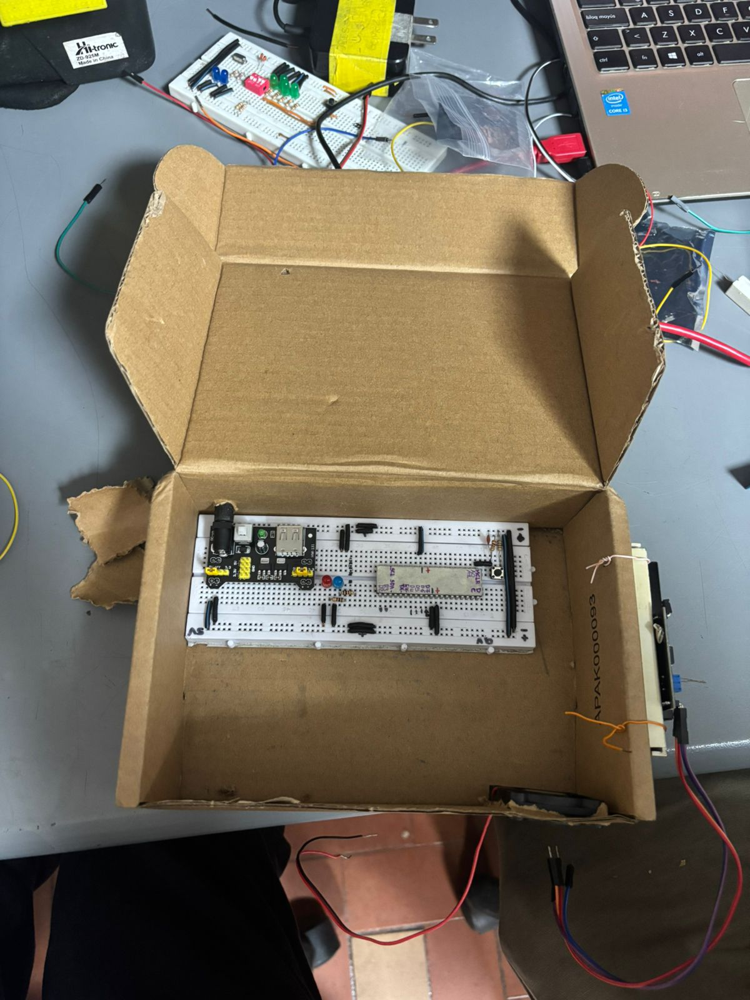
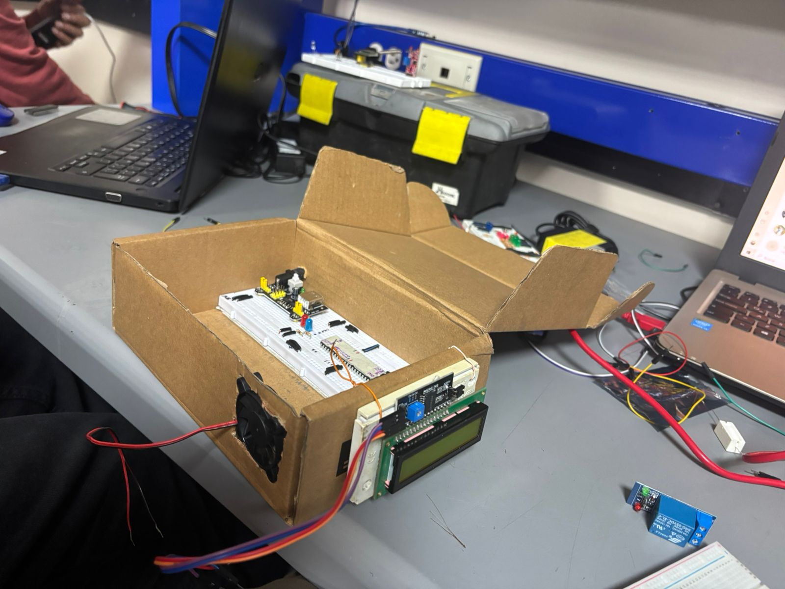
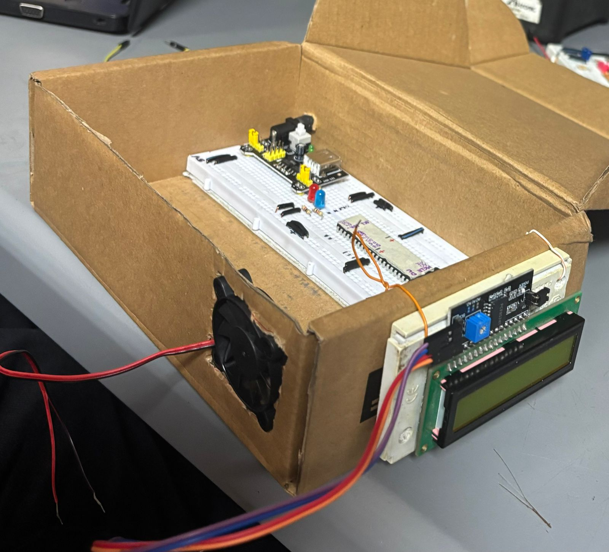
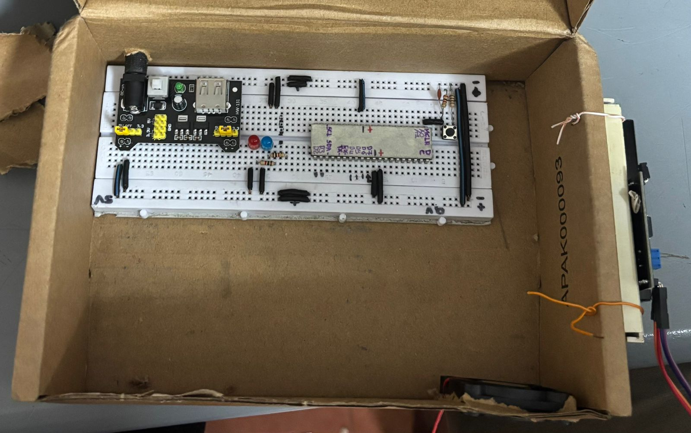
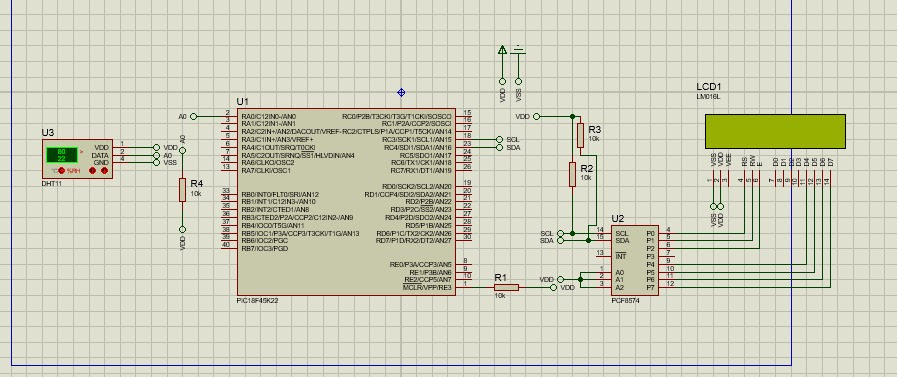

# Proyecto final

### Integrantes

[Sebastian vela Ruiz](https://github.com/Sebasvela28)

[Sebastian Guzman Verano](https://github.com/JuanSebastianGuzmanVerano)

[Jeisson Steven Gomez Salcedo](https://github.com/Ja2000ck)

### Nombre del proyecto: 
Proyecto: Estacion de Monitoreo Ambiental
Medición de Temperatura y Humedad con Activación de Ventilador y Resistencia

### Documentación

## Objetivo del Proyecto
El objetivo de este proyecto es construir un sistema que pueda medir la temperatura y la humedad del ambiente, y que pueda tomar decisiones simples de forma automática. Si hace mucho calor, el sistema prende un ventilador. Si el ambiente está muy húmedo, prende una resistencia para tratar de reducir esa humedad.

## Materiales y Herramientas Utilizadas

Microcontrolador PIC18F45K22

Sensor DHT11 

Rele

Pantalla LCD con conexión I2C 

Ventilador de 12v  

Resistencia calefactora en ceramica 

Protoboard 

Cables de conexión

Computadora con programa de desarrollo

Lenguaje de programación C

## Procedimiento e Implementación

## Configuración inicial:

Se instaló un sensor que mide dos cosas: qué tan caliente está el ambiente (temperatura) y cuánta humedad hay en el aire.

Se conectó una pantalla para mostrar estos valores en tiempo real.

## Programación del sistema:

El microcontrolador fue programado para leer la información del sensor cada cierto segundo.

Si la temperatura pasaba los 25 grados Celsius, se encendía un ventilador se prendía un LED rojo que indicaba que el ventilador se encendia 

Si la humedad pasaba el 40%, se encendía una resistencia que genera calor  se prendia el led azul

## Visualización:

En la pantalla se mostraban los valores actuales de temperatura y humedad.

Si el sensor no funcionaba bien, también se mostraba un mensaje de error.

## Resultados

Cuando la temperatura era baja (por ejemplo, 23°C), el ventilador permanecía apagado.

Cuando la temperatura subía a más de 25°C, el LED y el ventilador se prendía automáticamente.

Lo mismo ocurría con la humedad: si estaba por debajo de 40%, la resistencia no se activaba; si pasaba de ese valor, el LED y la resistencia se encendía.

Todo esto ocurría de forma automática, sin necesidad de que alguien lo controle manualmente.

### Diagramas e imagenes 

## Montaje

## Proteus

## Diapositivas 

### Conclusiones

El sistema logró funcionar correctamente: leyó la temperatura y la humedad, mostró los datos en pantalla, y encendió los actuadores cuando fue necesario.

Es una forma básica pero muy útil de automatizar el control del ambiente, algo que se usa en casas inteligentes, invernaderos o laboratorios.

Aunque los componentes reales (ventilador y resistencia) fueron representados con luces LED, la lógica que controla esos aparatos es completamente funcional.

